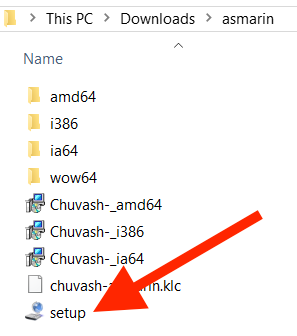
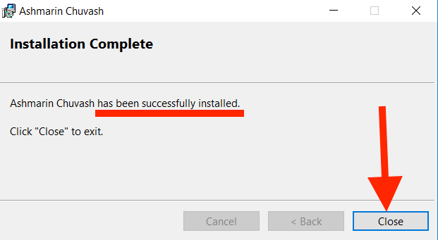
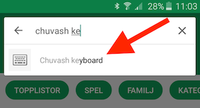
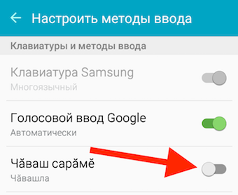
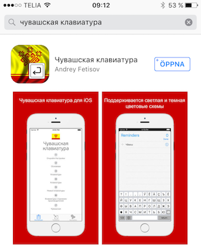
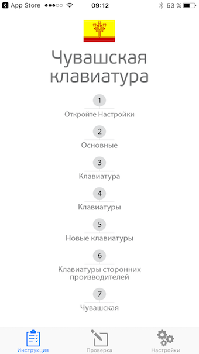
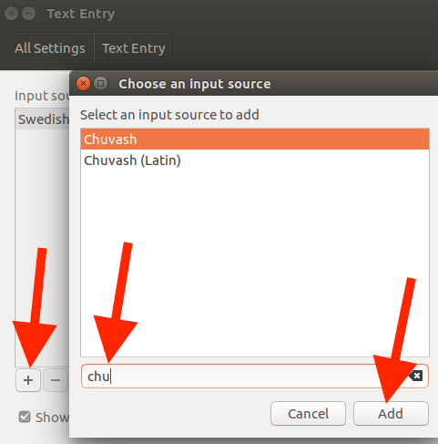
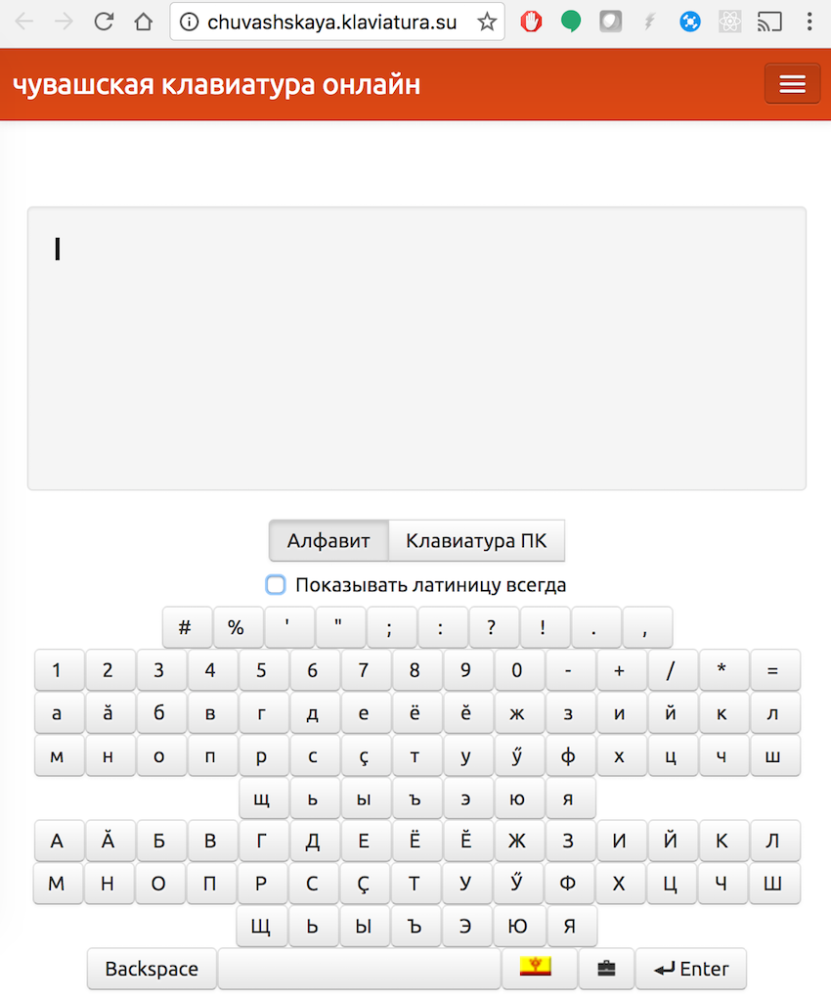

# Chuvash Keyboard Setup
This information is maintained by Miron Toli @mirontoli. Last updated 2017-02-02.

1. [Windows](#windows)
1. [Android](#android)
1. [iOS](#ios)
1. [Linux](#linux)
1. [Mac](#mac)
1. [Web](#web)

## Windows
The Chuvash Keyboard Layout allows you to type Russian as you would with the usual Russian layout, 
but you will also have access to the Chuvash letters Ӑ Ӗ Ҫ Ӳ.
They can be typed by holding the <kbd>AltGr</kbd> key and typing А Е С У.

### How to Install

1. Download [the installation file](http://bit.ly/cv-kbd-win) and unzip it. 

2. Run `setup.exe`.

  

3. Close the window after the installation is complete:

  

4. Done! To change the keyboard layout to Chuvash, click on the language panel:

  

### Additional Letters
As a bonus, you will have access to the old Chuvash characters (Zolotnitsky, Yakovlev and Ashmarin),
and also symbols used in the formatting of articles on Wikipedia. If you are interested, you can learn more
at the [Ashmarin Keyboard Layout Project Page](http://bit.ly/asm-kbd).

## Android

Install the [Chuvash Keyboard](http://bit.ly/cv-kbd-android) from the Google Play Store. 
Follow the instructions in the application.

Find the application in the Google Play Store:

Click "Install":

Open the application:

Press "1. Ҫак сарӑма ҫутӑр" (translation: Activate this keyboard):

Activate "Чӑваш сарӑмӗ" (translation: Chuvash keyboard):

When a warning pops up, press "OK":

Select the keyboard by clicking on "2. Ҫак сарӑма суйлӑр" (translation: Select this keybord).
On the next menu, click "Чӑвашла":

## iOS

Download the application [Чувашская клавиатура](http://bit.ly/cv-kbd-ios) (translation: Chuvash keyboard) by Andrey Fetisov,
which costs about 70 Rubles or $0.99. 

Open the application and set up the keyboard as shown in the instructions (in Russian): 

## Linux

The Chuvash keyboard on Linux is built in. Just like on Windows, you can type the Chuvash letters Ӑ Ӗ Ҫ Ӳ
by pressing <kbd>AltGr</kbd> and one of the letters А Е С У.
You will also be able to type Russian. 

### Setup Instructions
We will show step-by-step instructions for the popular distro Ubuntu.

1. Right-click on the language menu in the upper right-hand corner of the screen:

  

2. In the window that opens, click on <kbd>+</kbd> to add an additional keyboard. Type `chu` and click <kbd>Add</kbd>.

 

3. Done! To change the keyboard, click on the language menu icon. 

## Mac

Chuvash Keyboard Layout (Input Source) is created using Ukulele according the steps described in [Salvatore Testas blog post](https://saltesta.com/hack/customizing-mac-input-source-icon/).

## How to install
1. Download [ChuvashKeyboardOSX.bundle.zip](http://bit.ly/cv-kbd-mac)

  

2. Open `~/Library/Keyboard\ Layouts/` in Finder from terminal (because it is a hidden folder)

  

3. Copy ChuvashKeyboardOSX.bundle into Keyboard Layouts directory.

  

4. Restart computer
5. Add Chuvash - PC as input source. 

  

### Additional Characters

In the Chuvash keyboard for Mac OS we have added additional characters: the old Chuvash characters, and characters used to write
other languages of the Russian Federation. 
If you need to type in Russian, Chuvash, Tatar, or, say, Udmurt, you can find more detailed information at the
[Keyboard Layout for Mac OS Project Page](https://github.com/mirontoli/chuvash-kbd/tree/master/Mac). 

## Web
If you are using another person's computer, or you don't have permission to install programs on your computer 
(for example, at work), you can use our virtual keyboard in your browser. 
Go to [chuvashskaya.klaviatura.su](http://bit.ly/cv-kbd-web), type what you need to type, and then copy and paste it elsewhere.

